# GitHub Actions Workflows for PromoTracker

This directory contains automated CI/CD workflows for testing and deployment.

## Workflows

### 1. `test-pr.yml` - Pull Request Testing

**Trigger**: Opens, updates, or reopens a pull request to `main` or `develop`

**Jobs**:
1. **Unit Tests** - Fast tests with mocked dependencies (no AWS needed)
2. **Deploy Test Stack** - Deploys temporary TestStack to AWS
3. **Integration Tests** - Tests Lambda functions against real AWS services
4. **End-to-End Tests** - Tests complete Step Functions workflow

**Duration**: ~5-10 minutes per PR

**What it does**:
- ✅ Runs all unit tests first (fast feedback)
- ✅ Deploys isolated test stack to AWS with mock API Gateway
- ✅ Runs integration tests against real DynamoDB, S3, Lambda
- ✅ Runs e2e tests with Step Functions
- ✅ Uses mock API endpoints for Firecrawl and OpenAI (zero external costs)
- ✅ Keeps test stack running during PR review
- ⚠️ Does NOT cleanup automatically (see cleanup workflow)

### 2. `cleanup-test-stack.yml` - Test Stack Cleanup

**Trigger**: PR is closed or merged, or manual workflow dispatch

**Jobs**:
1. **Cleanup** - Destroys test stack and all resources

**Duration**: ~2-3 minutes

**What it does**:
- 🗑️ Empties S3 bucket
- 🔥 Destroys TestStack CloudFormation stack
- 🔑 Removes test API keys from Parameter Store
- ✅ Verifies cleanup completed successfully

**When it runs**:
- Automatically when PR is closed (merged or not)
- Manually via GitHub Actions UI

## Required GitHub Secrets

Configure these secrets in your repository settings:

1. **`AWS_ACCESS_KEY_ID`** - AWS access key with permissions to:
   - Deploy CloudFormation stacks
   - Create/delete Lambda functions
   - Create/delete DynamoDB tables
   - Create/delete S3 buckets
   - Create/delete API Gateway endpoints
   - Manage Parameter Store
   - Invoke Lambda functions

2. **`AWS_SECRET_ACCESS_KEY`** - Corresponding AWS secret key

**Note**: Firecrawl and OpenAI API keys are **NOT required**! The test stack uses a mock API Gateway with Lambda endpoints that simulate these services, eliminating external API costs.

### Setting up secrets:

1. Go to repository **Settings** → **Secrets and variables** → **Actions**
2. Click **New repository secret**
3. Add each secret with the exact name listed above

## Mock API Server Architecture

The testing infrastructure uses **AWS API Gateway + Lambda** to create mock API endpoints that simulate Firecrawl and OpenAI APIs. This is a **best practice** for cloud-native testing according to AWS guidelines.

### How It Works

```
┌─────────────────────────────────────────────────────┐
│           Test Environment (AWS)                    │
│                                                     │
│  ┌────────────┐         ┌──────────────────┐      │
│  │   Scraper  │────────▶│  API Gateway     │      │
│  │   Lambda   │         │  (Mock Server)   │      │
│  └────────────┘         └──────────────────┘      │
│        │                         │                 │
│        │ HTTP POST               │                 │
│        │ /v2/scrape              ▼                 │
│        │                 ┌──────────────┐          │
│        │                 │ Mock         │          │
│        │                 │ Firecrawl    │          │
│        │                 │ Lambda       │          │
│        │                 └──────────────┘          │
│        │                                           │
│  ┌────────────┐         ┌──────────────────┐      │
│  │  Detector  │────────▶│  API Gateway     │      │
│  │   Lambda   │         │  (Mock Server)   │      │
│  └────────────┘         └──────────────────┘      │
│        │                         │                 │
│        │ HTTP POST               │                 │
│        │ /v1/chat/completions    ▼                 │
│        │                 ┌──────────────┐          │
│        │                 │ Mock         │          │
│        │                 │ OpenAI       │          │
│        │                 │ Lambda       │          │
│        │                 └──────────────┘          │
│                                                     │
└─────────────────────────────────────────────────────┘
```

### Benefits

✅ **No External API Costs** - Mock responses don't call real APIs
✅ **Deterministic Testing** - Same input always produces same output
✅ **Fast Execution** - No network latency to external services
✅ **Reliable** - Tests don't fail due to API rate limits or outages
✅ **Production-like** - Tests actual HTTP calls and error handling
✅ **No API Keys Needed** - Dummy keys suffice for Parameter Store

### Configuration

Lambda functions use environment variables to determine API endpoints:

**Production Stack**:
- Scraper calls: `https://api.firecrawl.dev/v2/scrape`
- Detector calls: `https://api.openai.com/v1`
- Uses real API keys from Parameter Store

**Test Stack**:
- Scraper calls: `<api-gateway-url>/v2/scrape` → Mock Firecrawl Lambda
- Detector calls: `<api-gateway-url>/v1/chat/completions` → Mock OpenAI Lambda
- Uses dummy API keys (not actually used)

For more details, see [MOCK_API_ARCHITECTURE.md](../../MOCK_API_ARCHITECTURE.md)

## Workflow Behavior

### On Pull Request Open/Update

```mermaid
graph TD
    A[PR Opened/Updated] --> B[Run Unit Tests]
    B --> C{Tests Pass?}
    C -->|Yes| D[Deploy Test Stack]
    C -->|No| E[❌ Fail PR Check]
    D --> F[Run Integration Tests]
    D --> G[Run E2E Tests]
    F --> H{All Tests Pass?}
    G --> H
    H -->|Yes| I[✅ PR Check Passes]
    H -->|No| J[❌ PR Check Fails]
    I --> K[Test Stack Remains Active]
```



### On Pull Request Close/Merge

```mermaid
graph TD
    A[PR Closed/Merged] --> B[Cleanup Workflow Triggered]
    B --> C[Empty S3 Bucket]
    C --> D[Destroy Test Stack]
    D --> E[Remove Parameter Store Keys]
    E --> F[✅ Cleanup Complete]
```



## Cost Analysis

### Infrastructure Costs (Per PR)

| Component | Cost per PR | Notes |
|-----------|-------------|-------|
| **Unit Tests** | $0.00 | Runs on GitHub runners |
| **API Gateway** | $0.00 | Within free tier (1M requests/month) |
| **Mock Lambdas** | $0.00 | Within free tier (1M requests/month) |
| **Test Lambdas** | ~$0.10 | Minimal invocations |
| **DynamoDB** | ~$0.05 | On-demand pricing |
| **S3 Storage** | ~$0.01 | Minimal data |
| **Step Functions** | ~$0.05 | Few state transitions |
| **CloudWatch Logs** | ~$0.05 | Short retention |
| **Total per PR** | **~$0.25-$0.50** | |

### External API Costs Eliminated

**Without Mock Server** (using real APIs):
- Firecrawl: $0.0006/scrape × 10 websites × 3 test runs = $0.018
- OpenAI: $0.002/request × 10 websites × 3 test runs = $0.060
- **Per PR Cost**: ~$0.08
- **20 PRs/month**: ~$1.60

**With Mock Server**:
- **External API Cost**: $0.00
- **Savings**: 100% of external API costs

### Cost Optimization Features

✅ **Auto-cleanup** - Prevents ongoing charges after PR closes
✅ **Concurrency limit** - Only one test run per PR at a time
✅ **Mock APIs** - Zero external API costs
✅ **Short log retention** - 1-day retention for test logs
✅ **On-demand pricing** - Pay only for actual usage

### Monthly Cost Estimate

- **20 PRs/month**: ~$5.00-$10.00 (infrastructure only)
- **External API costs**: $0.00 (mocked)
- **Total**: ~$5.00-$10.00/month

## Manual Cleanup

If needed, you can manually trigger cleanup:

1. Go to **Actions** tab in GitHub
2. Select **Cleanup Test Stack** workflow
3. Click **Run workflow**
4. Select branch and click **Run workflow**

## Troubleshooting

### Test stack deployment fails

**Check**:
- AWS credentials are valid
- Account has necessary permissions
- CDK is bootstrapped: `cdk bootstrap aws://ACCOUNT/eu-west-2`

**Solution**: Run bootstrap manually if needed

### Cleanup fails

**Check**:
- S3 bucket might not be empty
- DynamoDB tables might have deletion protection

**Solution**: Run manual cleanup workflow or use AWS Console

### Tests fail with "Parameter not found"

**Check**:
- GitHub secrets are configured correctly (only AWS credentials needed)
- Parameter Store deployment step succeeded
- Dummy API keys were stored during deployment

**Solution**: Verify `AWS_ACCESS_KEY_ID` and `AWS_SECRET_ACCESS_KEY` secrets exist. The workflow automatically stores dummy API keys for testing.

### Stack already exists error

**Cause**: Previous cleanup didn't complete

**Solution**:
1. Run manual cleanup workflow
2. Or delete stack manually: `aws cloudformation delete-stack --stack-name TestStack --region eu-west-2`

## Workflow Files Explained

### `test-pr.yml` Structure

```yaml
jobs:
  unit-tests:           # Fast, no AWS required
  deploy-test-stack:    # CDK deploy TestStack with mock API Gateway
  integration-tests:    # Test with real AWS + mock APIs
  e2e-tests:           # Full workflow test with mock APIs
```

**Key Steps in Deploy Job**:
1. Build Lambda layers (dependencies and shared code)
2. Store dummy API keys in Parameter Store (not actually used)
3. Deploy TestStack with mock API Gateway endpoints
4. Configure Lambda environment variables to use mock URLs

### `cleanup-test-stack.yml` Structure

```yaml
jobs:
  cleanup:
    - Check stack exists
    - Empty S3 bucket
    - Destroy stack
    - Clean Parameter Store
    - Verify cleanup
```

## Best Practices

1. **Always wait for tests** before merging PRs
2. **Review test results** in GitHub Actions tab
3. **Check costs** in AWS console periodically
4. **Keep secrets secure** - never commit API keys
5. **Use branch protection** to require passing tests

## Monitoring

### View Test Results

1. Go to **Actions** tab
2. Select the workflow run
3. Click on individual jobs to see logs

### Check AWS Resources

```bash
# List test stacks
aws cloudformation list-stacks --region eu-west-2 | grep TestStack

# List test Parameter Store keys
aws ssm describe-parameters --region eu-west-2 | grep PromoTracker/Test
```

## Future Enhancements

- [ ] Add test coverage reporting
- [ ] Post test results as PR comments
- [ ] Add performance benchmarking
- [ ] Deploy to staging environment on merge
- [ ] Slack/email notifications for failures
- [ ] Parallel test execution
- [ ] Test result caching

## Support

For issues with workflows:
1. Check workflow logs in Actions tab
2. Verify AWS credentials and permissions
3. Review this documentation
4. Check [tests/README.md](../../tests/README.md) for test-specific help
